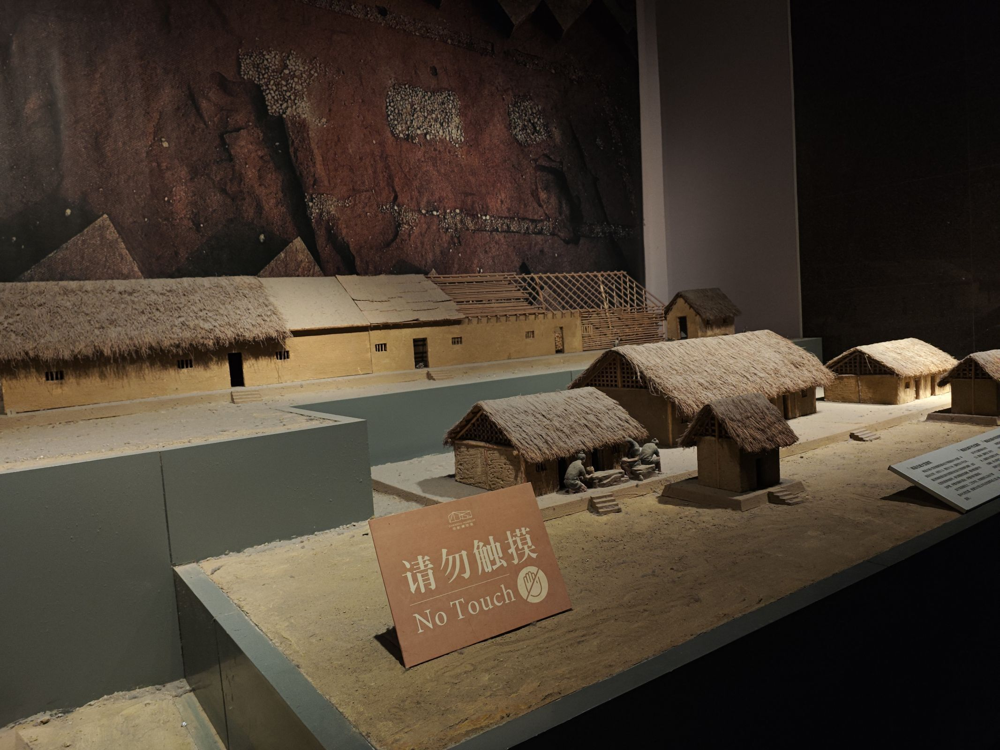
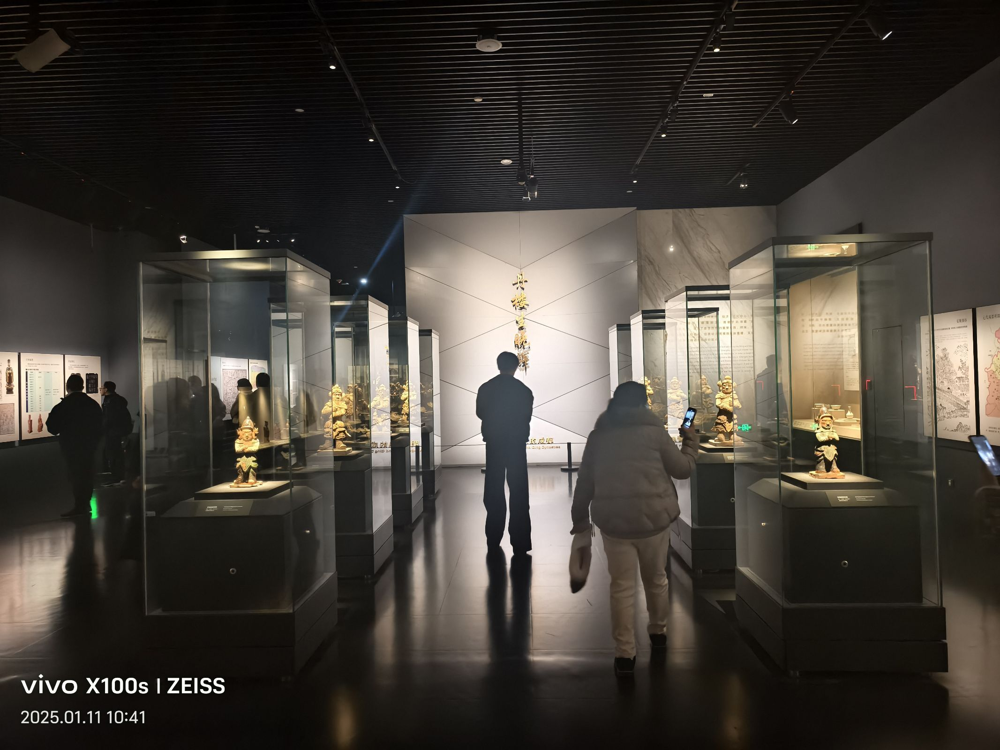

成都博物馆，这座矗立于天府之国心脏地带的璀璨明珠，犹如一幅铺展千年的文化长卷，静静吟唱着成都的悠悠岁月与辉煌篇章。它坐落于锦官城的繁华之中，与杜甫草堂的静谧、武侯祠的古韵交相辉映，共同绘制着成都独有的文化图谱。 

步入这座博物馆，走进了杜甫笔下“锦官城”的繁华盛景。馆内珍藏的每一件文物，都如同历史长河中闪烁的星辰，轻轻诉说着成都的悠悠往事。1F成都秦汉时期展厅，2F成都唐宋时期展厅，3F成都明清时期展厅，4F民俗和近代展馆。其中非常有特色的，成都的华美漆器，向游客们展现古代审美，黑色与红色的相融合更凸显传统文化的历史厚重感；春秋时期各类物件上刻画着蚕的身影，也是体现着这时人们已经开始了种桑养蚕从事纺织；因蜀道之难，秦借口沟通交流修建金牛道，换来的是巴蜀被秦吞并；都江堰的著名无需多言，至今仍在用的“天府之国”的称号便是其最好的证明；汉代展厅所展示的最早的提花织机模型，独占展厅一块区域，是世界之最早的；船棺，设计成船状是古人希望乘船去往世界另一边，这个墓葬对研究凌倾制度有意义，而所展出的船棺，其实已然庞大，却仍只是中小型船棺；成都道教发源历史悠久，古蜀王得仙道的传说流传甚广，张陵在青城山创立五斗米教，进一步推动了道教在成都的发展；成都大成政权后来演变为成汉，成汉的汉兴年间，李寿开创了年号钱的先河，铸造了印有“汉兴”字样的钱币，这标志着中国古代钱币从重量记名向年号记名的转变，具有重要的历史意义；隋唐时期，成都城市规模得到扩建，都江堰等水利工程再次进行改道，促进了农业灌溉，使得蜀锦生产再次迎来蓬勃发展；五代十国时期，成都先后为前蜀和后蜀的都城。后蜀孟昶发明了历史上第一副春联。当时，成都的赶集文化盛行，十二月市各具特色，如一月灯市璀璨、二月花市芬芳、三月蚕市热闹，商业空前繁荣，交子这一世界上最早的纸币也在此时期出现；成都因其茶叶产量大且品质优良，成为了饮茶文化的发源地之一，茶馆遍布，茶马古道闻名遐迩，推动了茶文化的深入发展······ 
成都博物馆以其宏大的规模和丰富的藏品著称，不仅涵盖了四川乃至西南地区的珍贵文物，更将成都的历史脉络清晰呈现。从“先秦至南北朝时期”的展厅，到“隋唐五代至宋元明清时期”的展区，每一件展品都如同李白所写的“九天开出一成都，万户千门入画图”，生动再现了成都作为古代西南重镇的繁荣景象。 
在近现代展厅，成都的近代历史如同薛涛笺上的墨香，缓缓铺展。从辛亥革命到抗日战争，再到新中国的成立，各件展品的独特故事，让人在感慨中看到成都人民的坚韧与智慧。 
不定期举办的各类临时展览，如同王维《山居秋暝》中的“空山新雨后”，为观众带来一阵阵清新的文化之风。无论是国际艺术交流展，还是本土文化遗产展，每一次展览都如同一次文化的盛宴，让人在品味中感受到成都的开放与包容。 

成都博物馆，这座文化的灯塔，不仅照亮了成都的历史长河，更以其独特的魅力，吸引着来自四面八方的游客。你可以细细感受那份“成都带酒浓如酽，蜀锦褓花娇欲语”的诗意与浪漫。它不仅是成都的文化名片，更是每一位到访者心中难以忘怀的文化记忆，让人在探寻中领略到成都这座城市的深厚底蕴与无限魅力。 
