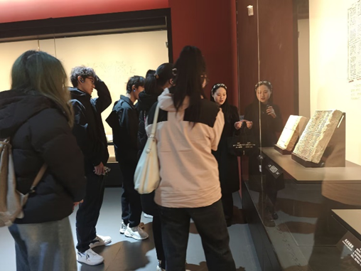
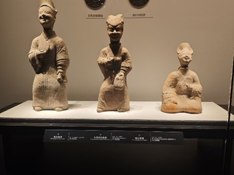

在2025年的寒假期间，我们组织并参与了西南交通大学寒假“返家乡”社会实践活动。该活动旨在为西南交大的学子提供一个深入了解成都文化及生活的机会，希望能使同学们在接下来的大学生活中，更好地融入成都，融入成都生活，除此之外，活动的结果输出还能通过网上传播的方式将巴蜀文化传播开来，让各地区人民也能够认识成都文化，了解巴蜀文化。 
在实践活动报名期间，同学们积极踊跃参与，渴望能够在活动中感受巴蜀风情。 
在实践前期，我在冯开元同学的全力协助下，通过指导老师田琛的指导，仔细安排好了各项事宜，以确保实践活动的顺利开展。 
在1月9日晚上七点，我们开始了我们实践的第一项：关于巴蜀文化的一场研讨会。。在会议开始前，田老师着重强调，社会实践活动是锻炼自身能力、拓宽视野、增长见识的重要契机。而后每位同学依次发言，发表自己对于巴蜀文化的的自身认知，然后观看了介绍成都的视频，便于让同学们对巴蜀文化有进一步了解。 

接下来的三天，我们实践队相继参观了四川博物院、成都博物馆、文殊院。在四川博物院中，同学们在专业的导览讲解的带领下，参观了两个古代四川展厅，系统且全面的了解了巴蜀文化的历史更迭，且其中数量居于院内首位的各种画像砖、言砖则深刻体现出古代四川丰富且璀璨的历史文化。 

而在成都博物馆中，主要是根据耳机端的讲解来深入了解博物馆展品以及探寻成都历史发展。不同于四川博物院的是，成都博物馆中有两个展厅是近世篇，这使得同学们更能直观地感受到成都的生活文化。文殊院则是完美展现出成都的建筑风格恢宏大气以及成都人民信奉佛教的一大习俗。 
一通参观下来，每位同学都有自己的独特且深刻的感受。在12号下午的总结会中大家分享了本次的实践之旅的心得体会，每个人都有自己感兴趣的方面，比如我对陶俑感兴趣，因为陶俑们笑颜如花、衣着打扮都很大气，这都体现了当时成都在此工艺上的造诣很好以及当时的人民安居乐业，连丫鬟都过得很开心舒适。又如冯同学，他对文殊院的对联及其他文化以及建筑感兴趣，等等。最后，指导老师田老师提出，要为这几天同学们的收获进行输出，大家便各抒己见。最终根据大家的建议，以及各自的能力进行工作内容的总括以及分工。输出形式包含但不限于网站的建立、视频制作以及不同方言版本配音。 

在此次实践活动中，同学们跟随巴蜀文化的历史更迭的脚步，逐步探索着巴蜀文化；不断拨开历史迷雾，透过文物展品，仿佛身临其境，与文物对话；在历史的长廊中，漫步于成都古巷中，将成都人民悠闲、和谐的日常生活尽收眼底。 