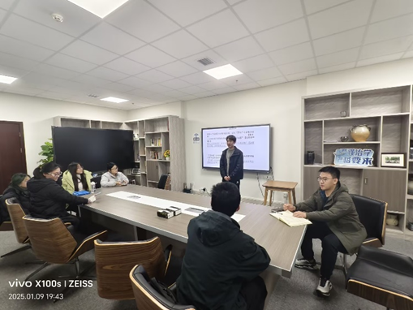
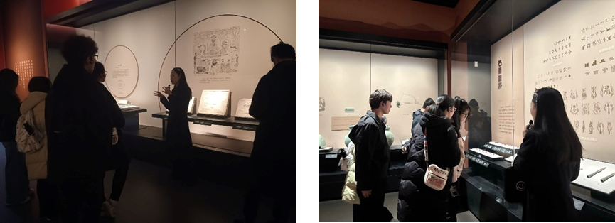
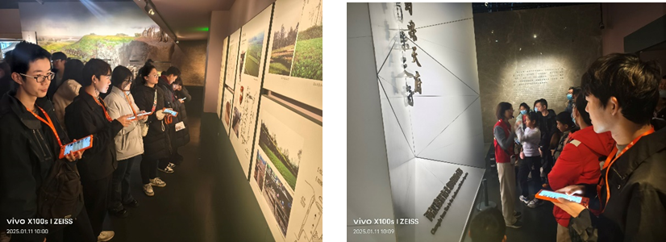

巴蜀，作为中国古代独具特色的地域文化概念，涵盖今四川、重庆地区，承载着深厚的历史底蕴与独特的文化魅力。为积极响应四川省委教育工委的号召，切实落实新时代学校思政课建设推进会精神，西南交通大学力学与航空航天学院青年志愿者协会精心组织了“寻巴蜀文化，探蓉城魅力”实践小队。他们奔赴四川博物馆、成都博物馆、文殊院等地，旨在将书本上深邃的理论知识与实地的生动实践紧密结合，深度探寻巴蜀文化，在行走中感悟历史，在体验中传承文化，全方位领略蓉城独特的文化魅力。
1月9日研讨会

2025年1月9日下午7点，“寻巴蜀文化，探蓉城魅力”实践小队在X30206开展重要研讨活动。本次研讨旨在初步了解巴蜀文化，规划后续三天行程。活动开场，指导老师田琛鼓励同学们在实践中拓宽视野、锻炼能力，深入探寻巴蜀文化内涵，为文化探索之旅筑牢根基。
研讨会上，成员们热情高涨，围绕成都文化畅所欲言。从红色精神到饮食、旅游文化，从气候、交通到当地人生活，再到诸葛亮故事、《蜀道难》等，话题丰富多元，思维碰撞出智慧火花。分享结束后，大家共同观看相关视频，进一步加深对巴蜀文化的理解。最后，负责人对后续行程和人员分工进行详细规划，确保每位同学明确任务职责，为实践活动的顺利推进奠定坚实基础。
1月10日四川博物馆
1月10日上午9点半，实践小队来到四川博物馆，在专业讲解员带领下开启探索之旅。
参观时，队员们发现四川祭祀文化独具特色，对数字五十分尊崇，墓葬物品数量常为五的倍数。先秦墓葬规模大，秦汉时变小且多建于崖壁，凸显古蜀人亲近天地的愿望。

政治上，秦朝“书同文车同轨”助力四川发展，印泥封条工艺精湛，成都成为功能分区明确的都城。生产领域同样出色，制盐、陶俑制造技术领先，规模化生产，流程规范，工匠署名保障质量。先秦时人们生活富足，有养老凭证可免费领粮，木质桥坚固耐用。唐朝佛教传入后，秦汉神话里西王母形象有所变化。礼仪方面，先秦起四川就和中原一样，等级制度严格，对饮食用具要求高，还通过石板刻文推动教育。此次参观，让队员们对巴蜀文化有了更深的认识。
1月11日成都博物馆
1月11日，“寻巴蜀文化，探蓉城魅力”实践小队走进成都博物馆。上午9点20分，队员们集合后入馆并租借语音讲解设备，开启文化探索。受时间限制，大家按兴趣和疑惑，有针对性地参观1F秦汉、2F唐宋、3F明清及4F民俗和近代展厅。
 
此次参观收获颇丰。队员们挖掘出成都文化发展的关键脉络，汉代世界最早的提花织机模型，彰显当时纺织业的发达；五代十国时，成都商业繁荣，诞生首副春联，交子的出现更是意义非凡。这些发现让队员们对成都文化的物质基础与发展轨迹有了清晰认知。这次参观丰富了队员们的知识，更助力成都历史文化的传承与弘扬，在他们心中种下传播文化的种子。

1月12日文殊院
1月12日上午9点，实践小队踏入成都文殊院，开启文化探秘之旅。一入院内，静谧祥和的氛围便感染着大家。在这里，成员们深入学习燃香供佛礼仪，严格按照传统手势操作，平举香至眉心，诚心许愿，默念的话语饱含对佛、法、僧的敬意。
小队还接触到“皈依”文化。“三宝”——佛、法、僧，意义深刻。皈依三宝不仅能成为佛的弟子、作为受戒基础，还被认为可减轻业障、积累福德。文殊院每月首个周日会举办皈依法会。此次参观，成员们领略了佛教文化魅力，加深了对传统文化的理解与认知。
活动接近尾声，实践小队组织了一场总结会。会上，成员们热情高涨，纷纷分享实践中的深刻感悟。有人惊叹于四川博物馆中展现的生产、墓葬文化，对古蜀人的智慧钦佩不已；有人对成都博物馆里的历史文物印象深刻，深感成都文化底蕴深厚；还有人分享了在文殊院了解佛教文化的新奇体验。这次实践，大家不仅学到丰富知识，更深刻领略到巴蜀文化的魅力。成员们表示，今后会积极传播这些文化，让更多人感受巴蜀文化的独特韵味，为传承和弘扬地域文化贡献力量。
