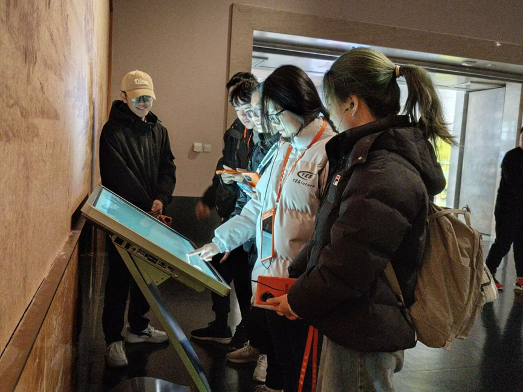
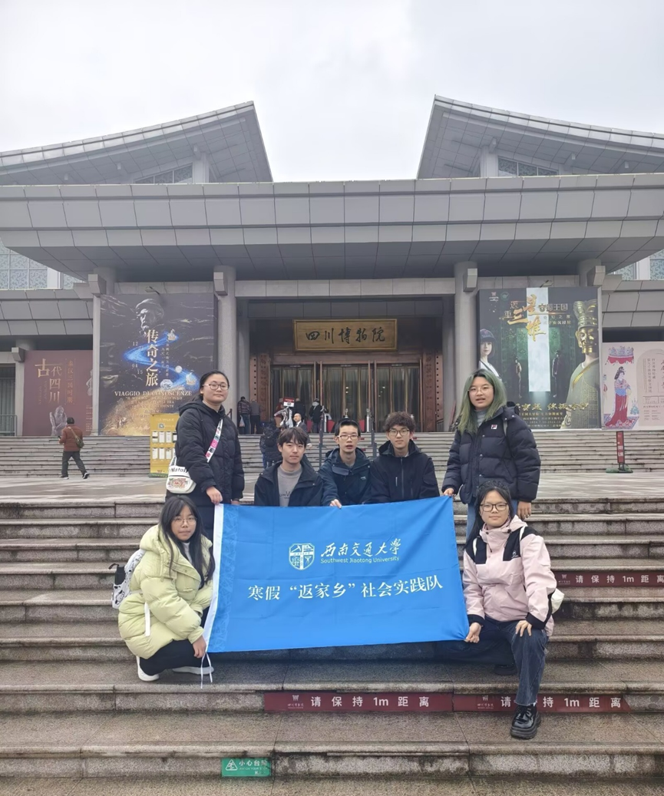
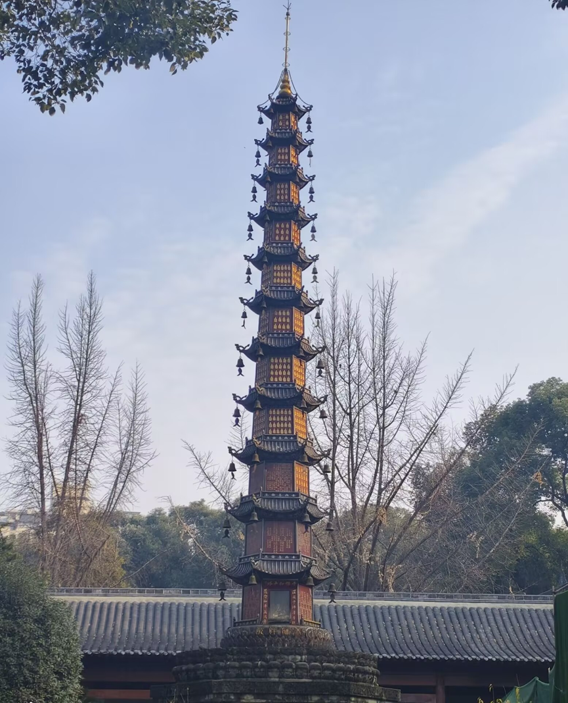

1月9日至1月12日下午，西南交通大学“寻巴蜀文化，探蓉城魅力”力航学院赴四川博物院等地调研实践队顺利展开川博“返家乡”实践活动并圆满结束。 
该活动旨在为同学们提供一次深度了解成都文化的机会，在实践中增进对四川、成都文化以及其背景——四川文化和物质基础——成都的制造业、建筑业等行业的认识了解。总要概括，该活动分研讨、实地调研、总结三个部分进行展开。 
第一阶段，1月9日晚上，调研实践队成员开展成都文化研讨大会，对成都文化的内涵意义，成都文化对我们的影响以及大家对成都文化的看法进行讨论。通过研讨，同学们对成都文化形成了初步了解，这为后续前往开展实践调研做好了一定的铺垫。 

第二阶段，1月10号，调研实践队正式前往四川博物馆展开实地调研。四川博物院作为西南地区最大的综合性博物馆，拥有丰富的馆藏文物。通过专业的导览讲解，同学们对四川文化有了非理论性的具体认识和感受。次日，同学们又前往成都博物馆对近代篇及民俗篇进行主要参观了解。成都博物馆浓厚的文化气息让同学们对成都近现代历史有了深切体会。1月12号上午，同学们在文殊院集合并展开调研，游览参观古成都建筑风格以及成都古代人民的日常生活。拥有“文殊院腊八节庙会“等成都市第七批非物质文化遗产代表性项目，对文殊院的参观让同学们对古成都的建筑民俗有了更加深入的认识。第二阶段实地调研的顺利完成，使得同学们对四川、成都文化形成了较为完整全面的认识体系。 

第三阶段，1月12号下午，同学们聚集一起就近几日的研讨及实地调研活动的心得收获进行分享总结。通过总结，同学们对古代四川文化有了更为客观全面的认知。总结大会为本次调研画上了完美的句号，至此“返家乡”实践活动圆满结束。 
