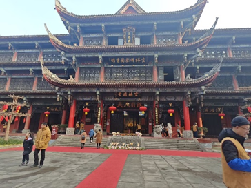

四川文化探索之旅：研讨会与文化圣地参观活动圆满落幕

2025年1月12日，一场旨在深入了解四川文化的研讨会及参观活动在西南交通大学圆满落幕，所有的参与者都从中收获了对四川文化的新理解。

研讨会：思想碰撞，共探文化奥秘
首次研讨会以“锦官城文化”为主题，聚焦于自身对于四川文化的了解。在研讨会上，各位同学纷纷分享了自己初次来到四川后对于四川文化的见解，从巴蜀文化的起源与发展，到现代四川文化的表现和传播，大家对此展开了热烈的讨论与交流。通过思想的碰撞，让同学们对四川文化的内涵有了更深刻的理解。在参观了三个景点之后，进行了第二次的研讨会，结合了第一次研讨会对四川文化的初印象和在博物院对四川发展历史的感悟，每一个人对四川文化都有了新的见解，并且期待未来在四川能够更好的感受四川文化。 

参观四川博物院：领略巴蜀文化魅力
第一轮研讨会结束后，参与者们前往四川博物院进行参观。作为西南地区最大的综合性博物馆，四川博物院馆藏丰富，涵盖了巴蜀青铜器、张大千绘画作品、四川汉代画像砖和陶塑等多个特色领域。在博物院内，大家仿佛穿越了时空，从古老的青铜器中窥见巴蜀先民的智慧与创造力，从精美的画像砖和陶塑里感受汉代四川的生活风貌，在讲解员的讲解下，所有人都能够从每一件文物的花纹上看见四川文化的发展和变化，每一件文物都有一段属于自己的历史，上面的每一个图案都有一段来历。博物院中尤其是张大千书画陈列馆，国内藏有张大千作品最多，其临摹敦煌壁画等作品让参观者们赞叹不已，仿佛置身于艺术的海洋。通过此次参观，参与者们对四川的历史文化有了更为直观和全面的认识。

参观成都博物院：感受城市文化脉搏
随后，大家又来到了成都博物院。这里不仅展示了成都从古至今的发展历程，还通过丰富的文物和展览，展现了这座城市独特的文化魅力。从古代的蜀锦到现代的文创产品，从传统的民俗活动到时尚的都市生活，成都博物院如同一部立体的史书，向参观者们讲述着成都的故事，每一层楼都代表着不同的历史阶段，能够进一步地感受到四川的发展历史，了解到四川文化是如何发展的。在这里，大家深刻感受到了成都作为历史文化名城的底蕴与活力，以及文化在城市发展中的重要作用。

参观文殊院：体验佛教文化与民俗风情
最后，参与者们走进了文殊院。作为全国汉语系佛教重点寺院和四川省重点文物保护单位，文殊院以其深厚的佛教文化底蕴和独特的园林古建吸引着众多游客。漫步在古朴典雅的寺院中，香烟袅袅，梵音阵阵，让人心旷神怡。寺内的佛像庄严慈祥，壁画精美绝伦，尤其是康熙御笔的“空林”二字旁的壁画，更是让人流连忘返。此外，我们了解到文殊院还是一处文化交流的场所，每年的春节、元宵节等重大节日，这里都会举行盛大的庙会活动，充满了浓厚的民俗风情。参观者们在这里不仅体验到了佛教文化的宁静与祥和，还感受到了四川民俗文化的丰富多彩。

通过此次研讨会及参观活动，参与者们对四川文化有了更深入的了解和感悟。大家纷纷表示，四川文化博大精深，值得我们去进一步探索和传承。未来，希望有更多类似的活动能够举办，让更多人了解和爱上四川文化。
