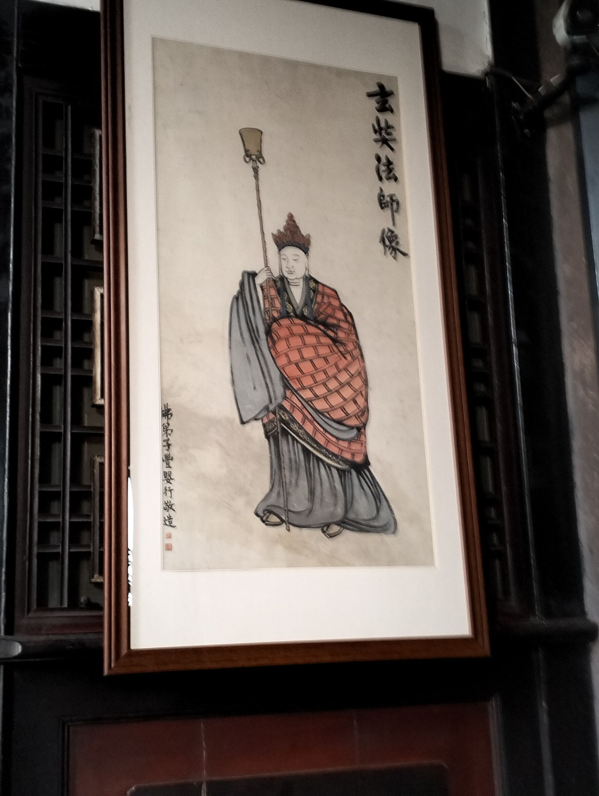
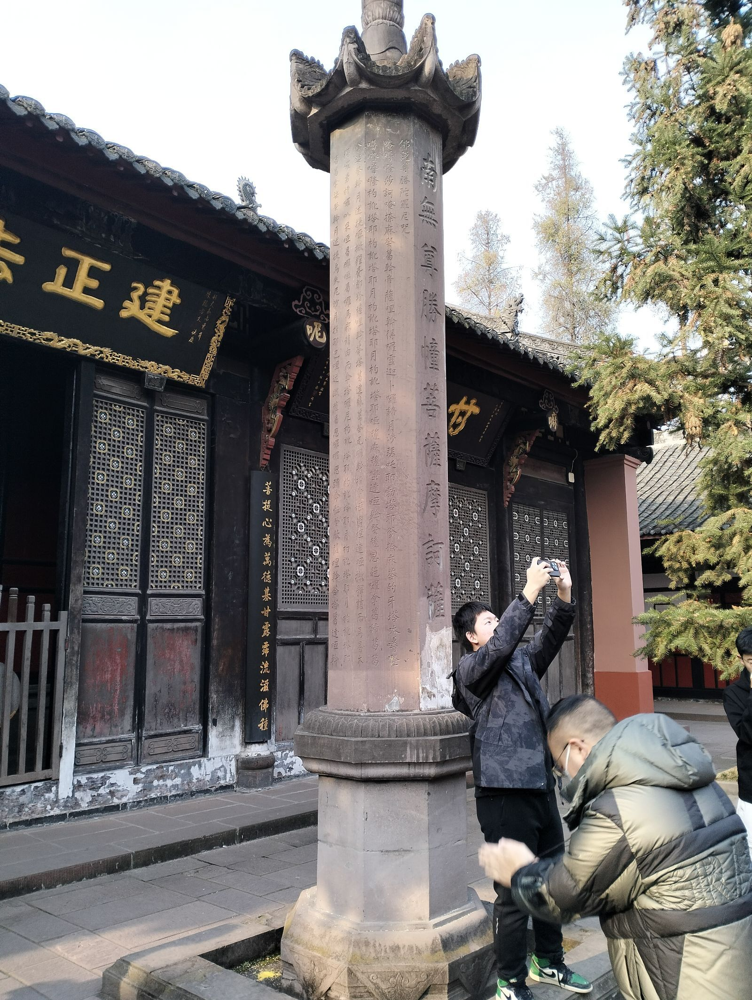

文殊院，是一座承载着深厚历史与文化底蕴的佛教圣地，建筑以中轴线为主导，建筑风格主要为重檐歇山式、单檐悬山式等，皆呈内向型布局。建筑的布局按照严格的层次和等级区别，体现礼制的制约。 
文殊院始建于隋大业年间（605~617年），最初名为信相寺。唐代，因唐武宗灭佛而一度毁损，后于唐大中元年（847年）得到修复。五代时，一度改名妙圆塔院。宋代，仍称信相寺。 

清康熙二十年（1681年），慈笃禅师来到荒芜的古寺，苦行修持，声名远扬。清康熙三十六年（1697年），官绅军民捐资重修寺庙，并更名为文殊院。此后，历经嘉庆、道光年间的改建和扩建，文殊院逐渐形成了今日的规模。 
走出地铁站，走过文殊院最庄严的正大门，石砖路的两侧，朱砂般的红墙蕴含着历史的厚重感。左侧墙上用黄色写着在中国文化中有极好寓意的汉字，其中“福”字，是游客们的必打卡之处。 

走进文殊院中，阵阵檀香将人包围。游客接过赠香，在佛像前真诚祈祷行礼，或是祈供灯，亲手写下自己的心愿，将这张纸用红绳挂于木架之下。院并不大，三大士殿、大雄宝殿、说法堂、藏经楼、千佛塔、圆通殿，游客步行参观下来的几分钟，也是古人走过时看到的相同风景。聆听寺中人敲击木鱼低声读出佛经中的文字，走出集中的几座楼，门外松树鲜花，文殊阁藏于小路的末尾，一卷卷藏书，墨香扑面。人们在高速现代化的时代终于停下脚步感受这一刻内心中的宁静与美好。 
文殊院是集禅林圣迹、园林古建、朝拜观光、宗教修学于一体的佛教圣地。以其悠久的历史、独特的建筑风格和深厚的文化底蕴吸引着无数游客前来参观。在这里，人们不仅可以领略到佛教文化的博大精深，还能感受到内心的宁静与平和。阳光照过树叶间隙，洒进这古韵古色的院子之中，更显这市中心处的古典建筑熠熠生辉。 
