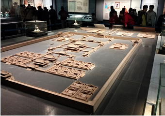
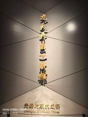
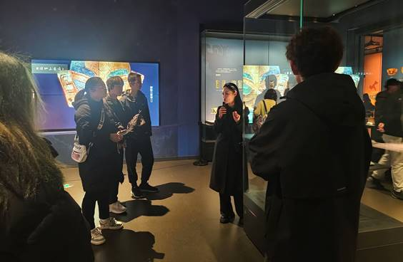

交大学子寒假深度探索成都文化，实践活动彰显文化自信

2025年寒假，西南交通大学组织了一场别开生面的社会实践活动，一群对历史文化充满热情的学生在专业讲解员的带领下，深入探访了成都的文化瑰宝——成都博物馆、四川博物院及文殊院。此次活动不仅丰富了学生们的寒假生活，更是一次对中华优秀传统文化的深度探寻与传承。

1月10日，活动在成都博物馆拉开帷幕。小组成员们在这里领略了成都乃至四川的历史变迁与文化传承。从古代篇的青铜器、陶瓷器，到民俗篇的生动场景再现，再到近代篇的历史记忆，每一件文物都承载着深厚的历史与文化底蕴。讲解员的生动讲解与互动体验让成员们仿佛穿越时空，与古人对话，深切感受到了成都文化的独特魅力。

次日，学生们走进了四川博物院。这座历史悠久的博物院以其独特的藏品和深厚的文化底蕴吸引了众多目光。学生们在这里不仅近距离观赏了珍贵文物，还了解了文创产品设计。这些活动不仅让学生们对四川历史文化有了更加全面而深刻的认识，更激发了他们对本土文化的热爱与自豪感。

 
1月12日，活动迎来了高潮——探访文殊院。这座拥有1400多年历史的禅林以其庄严的殿堂、精美的佛像和深厚的佛教文化底蕴让学生们叹为观止。在院内，学生们参观了六重大殿、照壁等古建筑，聆听了关于文殊菩萨的传奇故事与文殊院的历史沿革。这些经历让他们深刻体会到了佛教文化的深远影响与和谐之美，也让他们对中华文化的博大精深有了更加深刻的理解。
 
此次社会实践活动不仅是一次对成都历史文化的深度探寻，更是一次心灵的净化与文化的传承。成员们在参观学习中不仅增长了知识、拓宽了视野，更重要的是激发了他们对本土文化的深厚情感与尊重。同学们共同参与的此次活动，让来自不同省份的小组成员们更加了解自己大学所处地域的文化。特别是对于那些对成都文化尚不熟悉的同学来说，这次活动成为了一个绝佳的窗口。在活动中，通过实地考察、亲身体验等多种形式，同学们深入了解了成都的历史沿革、民俗风情、美食文化以及现代发展。漫步在文殊院，感受着老成都的生活气息······这些经历不仅让同学们对成都的文化有了更加直观和深刻的认识，也激发了他们对这座城市的热爱与向往。

此次寒假社会实践活动，不仅让同学们在实践中增长了见识、锻炼了能力，更重要的是，它成为了一座桥梁，连接起了不同地域文化之间的交流与融合，让每一位参与者都能在文化的海洋中遨游，收获满满。这一活动也彰显了西南交通大学在培养学生文化自信与责任感方面的积极探索与实践。

据悉，西南交通大学将继续探索更多形式的社会实践活动，为学生提供更多接触和了解本土文化的平台，培养他们的文化自信与责任感。同时，学校也将加强与各类文化机构的合作与交流，共同推动中华优秀传统文化的传承与发展。
