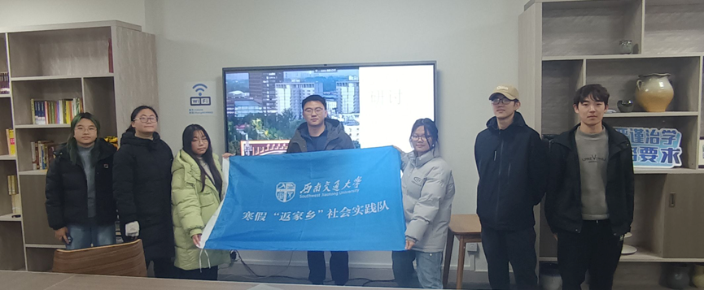
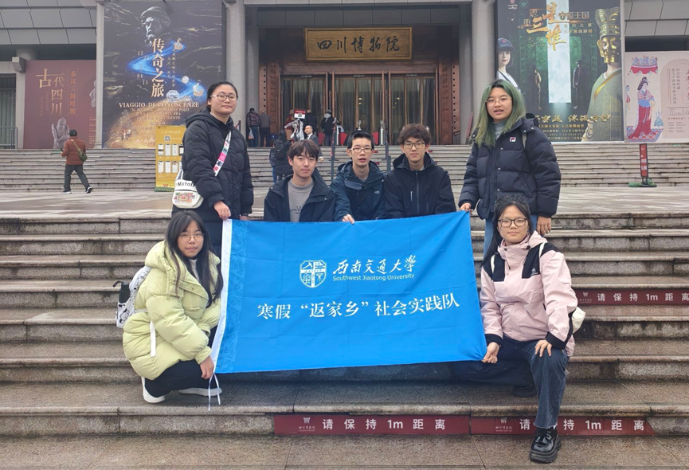
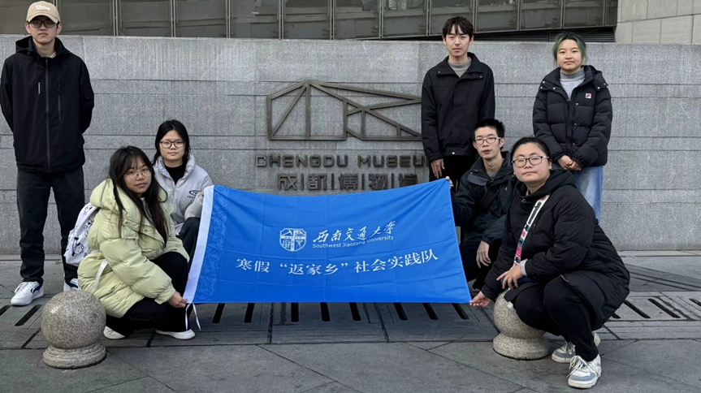
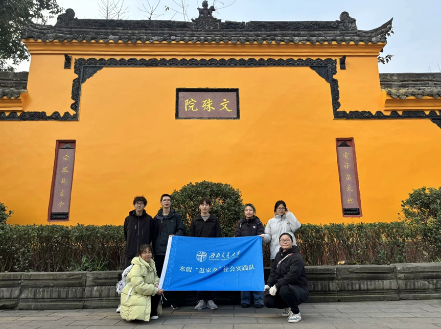
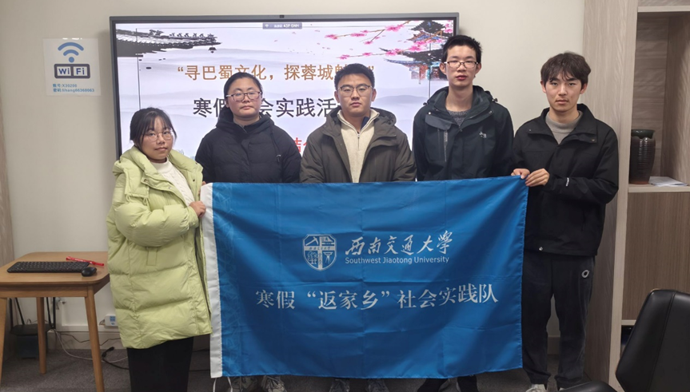

为了更加充分的了解成都文化的发展兴盛历程及其重要的文化内涵与价值，巴蜀文化探索实践队于1月9日到1月12日分别前往四川博物馆、成都博物馆和文殊院开展了为期三天的成都文化调研活动，在此期间，我们全面梳理和深入挖掘了成都独特的文化内涵，为城市文化的传承、创新与发展提供了坚实的支撑。 
1月9日晚19：00至21：00，在出发前的晚上，我们在田琛老师的指挥和带领下，在西南交通大学犀浦校区30206教研室对成都文化展开了详细讨论和研究。在会议中，大家就成都文化积极发表自己的见解，在深入讨论后，我们确立了将成都文化分为民俗文化、宗教文化、艺术文化与古蜀文化四大板块体系。之后，大家一起观看了有关成都文化的宣传视频，对成都文化四大板块体系有了进一步的补充和完善。在田琛老师的强调下，我们总结了对于四大文化板块体系中的疑点盲点，在日后的调研学习中进一步的学习与完善。 

在之后三天时间里，我们先后前往四川博物馆、成都博物馆和文殊院展开了调研学习。在调研学习过程中，我们进一步提升了自己对成都文化发展由来与成都文化的文化内涵和价值，并进一步消除了对成都文化四大板块体系的盲点和未知。在前往四川博物馆和成都博物馆调研学习的过程中，我们初步形成了成都文化“古蜀文明奠基-秦汉时期发展-唐宋时期鼎盛-元明清时期传承与变迁-近现代变革与创新”的发展时间线。在前去文殊院的调研学习中，大家对成都文化中的佛教文化以及祭祀文化有了更加全新的认知。 

1月12日下午，在结束了文殊院的参观学习后，田琛老师带领大家回到30206教研室对成都文化调研活动展开了总结讨论。在会议中，大家先后发表了对此次成都文化探索之旅的收获与感悟，对成都文化中遗留的盲点问题进行了全面扫除，进一步完善了成都文化四大板块体系。 

本次巴蜀文化探索之旅成功开展，极大程度的完善了同学们对巴蜀文化尤其是四川文化的认知了解，同时，也具备了向其他同学介绍成都文化的能力。在本次文化探索之旅完满结束后，社会各界人士都可通过登录我们的宣传网站（https://bashu.nonamewebsite.us.kg）观看成都文化宣传视频以及新媒体新闻稿增进自己对于成都文化的了解。文化是个人精神的滋养源泉，是社会和谐运转的黏合剂，是经济发展的新引擎，更是民族传承延续的血脉。文化传承，任重道远，仍需我们为之源源不断付出努力和行动。