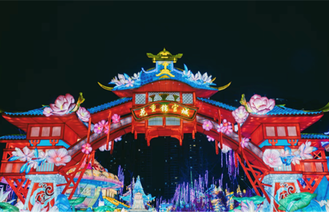
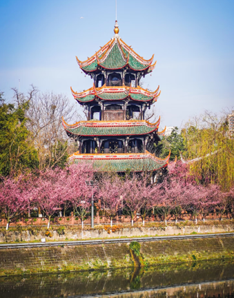
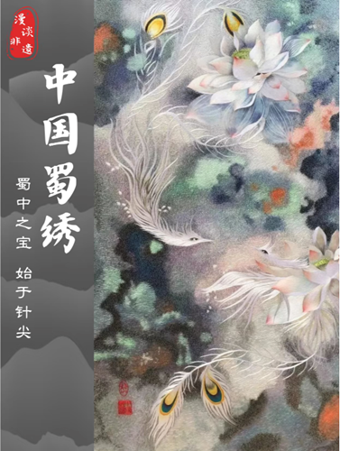
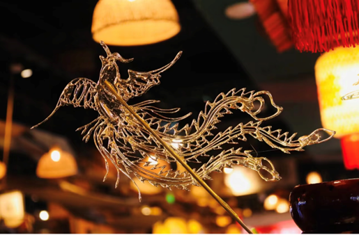
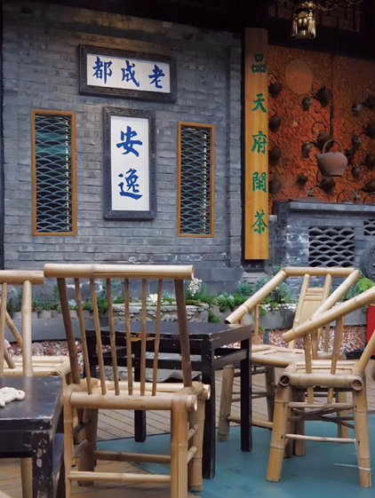

成都，这座古老而又充满活力的城市，宛如一部厚重的史书，每一页都书写着独特的故事，其中民俗文化更是熠熠生辉，散发着迷人的魅力。它是成都人民千百年生活智慧的结晶，承载着城市的记忆与情感，在岁月的长河中传承、演变，至今仍深刻影响着成都人的生活。

## 热闹非凡的传统节庆
成都传统节庆民俗活动缤纷多彩，节日氛围浓郁。正月的成都灯会是视觉盛宴，夜幕降临时，公园、广场化作灯海。动物造型花灯灵动逼真，兔子活泼、巨龙威严；神话传说场景灯组如梦似幻，嫦娥奔月、牛郎织女相会栩栩如生；还有融入现代科技的创意花灯，展现时代气息。人们穿梭其中，欢声笑语，沉浸在欢乐氛围里。
二月的成都花会别具魅力。各大花卉市场与公园繁花似锦，牡丹华贵、玫瑰娇艳、兰花淡雅，珍稀花卉争奇斗艳。花会不只是花卉展示，更集传统文化之大成。现场花艺师精心搭配花枝，创作出精美插花；剪纸、糖画、面人等民间手工艺品琳琅满目。人们漫步花丛，既能感受春日气息，又传承着古老花会习俗，尽享文化与自然交融之美。

## 独具特色的民间技艺
成都民间技艺是民俗文化瑰宝，彰显着成都人民的智慧与创造力。蜀绣，作为中国四大名绣之一，凭借严谨针法、平齐针脚、光亮片线与鲜艳色彩著称。绣娘们端坐绣架前，手持绣针灵活穿梭，把丝线精心编织在绸缎上，无论是灵动的花鸟鱼虫、秀丽的山水风景，还是逼真的人物肖像，都被绣得栩栩如生。蜀绣作品艺术价值极高，常被当作珍贵礼品，承载着成都人民的美好祝愿。

糖画是成都街头的独特风景。糖画艺人舀起熬好的糖液，在石板上快速创作。手腕翻转间，糖液如丝般流淌，转瞬便勾勒出活灵活现的造型，比如威风凛凛的凤凰。艺人用小铲轻轻一铲，插上竹签，一个可赏可食的糖画艺术品就诞生了。孩子们总是满怀期待，紧紧盯着艺人动作，拿到糖画后，更是满心欢喜，小心品尝这甜蜜滋味。

## 扎根生活的民俗风情
茶馆文化深深扎根于成都人的日常生活。在成都的大街小巷，茶馆随处可见。走进茶馆，竹椅、方桌整齐排列，茶客们悠闲地坐着，点上一杯盖碗茶。茶博士手持长嘴铜壶，穿梭于茶桌之间，只见他手臂一挥，铜壶里的开水如一条银龙般准确无误地落入茶碗中，动作娴熟，令人称奇。茶客们一边品茶，一边聊天，谈天说地，分享着生活中的琐事。茶馆里还常常有评书表演，评书艺人绘声绘色地讲述着历史故事、民间传说，听众们听得如痴如醉，时而哄堂大笑，时而鼓掌叫好。在这里，时间仿佛慢了下来，人们享受着这份悠闲与惬意，茶馆也成为了成都民俗文化交流的重要场所。
成都的民俗文化丰富多彩，从传统节庆到民间技艺，再到日常生活中的点滴，每一个元素都展现着这座城市独特的魅力。它不仅是成都人民的精神寄托，更是吸引着无数游客前来探寻、体验的文化宝藏。在时代的发展浪潮中，成都民俗文化不断传承创新，绽放出更加绚丽的光彩。
