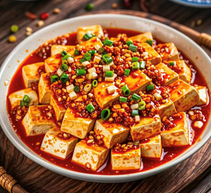
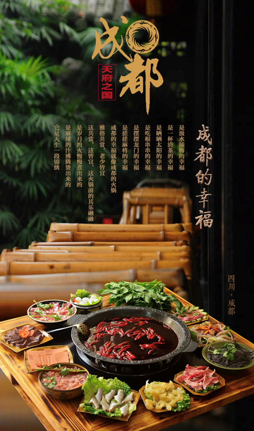
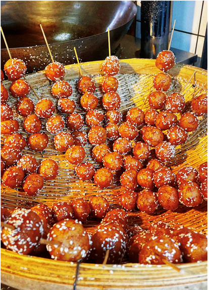

成都是一座以美食闻名遐迩的城市，其饮食文化源远流长、博大精深，历经岁月沉淀，形成了独具一格的魅力，吸引着世界各地的食客纷至沓来，沉醉在这舌尖上的盛宴中。
    成都饮食文化的核心代表——川菜，作为中国四大菜系之一，以“善用三椒，一菜一格，百菜百味”著称。辣椒、花椒、胡椒在川菜厨师的妙手下，交织出丰富多样的味道层次。麻婆豆腐，看似朴实无华，却将川菜的麻辣鲜香展现得淋漓尽致。鲜嫩的豆腐浸泡在红亮的汤汁里，表面点缀着翠绿的葱花与褐色的肉末，一勺入口，先是辣椒的热辣瞬间点燃味蕾，紧接着花椒的麻味在舌尖上跳跃，两种味道相互交融，刺激着每一个味觉神经，让人欲罢不能。
    
火锅，无疑是成都饮食文化的一张闪亮名片。成都火锅以麻辣锅底为灵魂，锅底中满满一层辣椒与花椒，搭配醇厚的牛油，经高温煮沸，香气四溢，弥漫在城市的大街小巷。食客们围坐在热气腾腾的火锅前，将毛肚、鸭肠、牛肉等食材依次放入锅中涮煮。“七上八下”涮毛肚，爽脆的口感伴随着麻辣滋味，在口腔中奏响一曲美妙的乐章；鸭肠涮至微微卷曲，入口脆嫩，麻辣鲜香瞬间在口中散开；鲜嫩的牛肉裹满了锅底的浓郁汤汁，每一口都充满了浓郁醇厚的味道。

    成都小吃更是种类繁多，令人眼花缭乱。钟水饺，小巧玲珑的饺子外皮薄而有韧性，肉馅鲜嫩多汁。上桌时淋上特制的红油辣椒，再撒上一些蒜泥汁水、芝麻油等调料，色泽红亮诱人。咬上一口，微甜带咸的肉馅与香辣的调料完美融合，口感丰富。龙抄手，抄手皮滑爽，肉馅饱满，汤汁鲜美。无论是清汤、红汤还是海味汤，每一种口味都有其独特的魅力。清汤抄手，汤汁清澈见底，味道鲜美醇厚，凸显出食材的原汁原味；红汤抄手则在鲜美的基础上，加入了浓郁的辣椒红油，香辣过瘾。
    糖油果子也是成都街头常见的特色小吃。色泽黄亮，外酥里糯，香甜可口。一个个圆润饱满的糖油果子串在一起，像是一串金黄的糖葫芦。刚出锅的糖油果子热气腾腾，咬上一口，酥脆的外皮裹着软糯的糯米团子，甜蜜的味道瞬间在口中散开，幸福感油然而生。
    成都的饮食文化不仅仅体现在美食本身，还体现在独特的用餐氛围与习惯上。成都人热衷于在热闹的餐馆或街边小店中聚餐，亲朋好友围坐一桌，共享美食，谈天说地。这种热闹融洽的用餐氛围，正是成都人热情好客、热爱生活的体现。在成都的大街小巷，随处可见装修风格各异的餐馆，既有古色古香、充满传统韵味的川菜馆，也有时尚现代的特色餐厅，还有那些隐匿在小巷中的街边摊。无论店面大小，每一家都有着自己独特的风味与故事，吸引着食客们前来探寻。
    成都饮食文化是这座城市历史与生活的生动写照，它以独特的风味、丰富的种类以及浓厚的生活气息，征服了无数人的味蕾。来到成都，品尝这里的美食，就是一次深入体验成都文化的奇妙之旅，让人在舌尖上领略到这座城市的独特魅力与无限风情。
