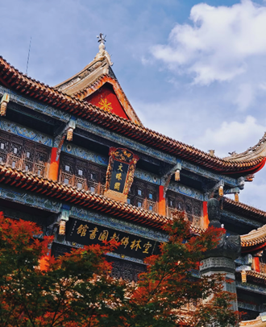
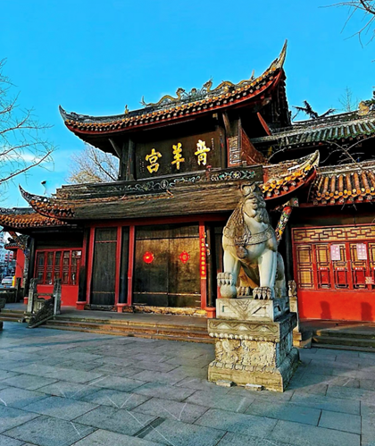

成都，这座承载着数千年历史的城市，不仅以美食、美景闻名于世，其深厚且多元的宗教文化更是散发着独特的魅力。佛教、道教等多种宗教在此落地生根，历经岁月洗礼，融入城市脉络，成为成都文化不可或缺的重要组成部分，滋养着人们的精神世界，也为这座城市增添了浓厚的人文底蕴。

## 佛教：慈悲智慧的传承
   佛教东汉传入成都后，在此落地生根，留下诸多珍贵遗迹。大慈寺，享有“震旦第一丛林”美誉，身处繁华太古里旁，却宁静庄严。它始建于魏晋，现存建筑多为清代风格。步入寺内，古木葱郁，香烟缭绕，大雄宝殿肃穆庄重，佛像慈悲。这里更是艺术殿堂，大量壁画保存完好，涵盖佛教故事、经变图，绘画技艺精湛，色彩鲜艳，尽显古代佛教艺术魅力。
文殊院也是成都佛教重要地标，这座清代古刹环境清幽，红墙青瓦与古柏相映成趣。寺内珍藏众多佛教文物，如唐玄奘法师头盖骨舍利（复制品）、宋代墨龙、明清佛像等，见证着佛教传承。僧人们每日虔诚课诵、研习佛法。每逢佛诞日、观音会，文殊院便人山人海，信徒们前来祈福朝拜，足见佛教在成都民众心中影响深远。
## 道教：自然和谐的追求
道教作为中国本土宗教，在成都根基深厚。青城山，以“青城天下幽”闻名，是道教发源地之一，位列道教十大洞天的“第五洞天” 。这里山水如画，峰峦叠嶂，云雾缥缈。沿着蜿蜒山路攀登，道观星罗棋布，其中天师洞声名远扬。它始建于隋朝大业年间，传说东汉张道陵在此结茅传道、降魔治鬼，获尊“天师”，天师洞也因此得名。道观内古木参天，殿宇恢宏，三清、张天师等神像庄严肃穆，既是道教信徒修行的圣地，也是游客感悟“道法自然”、体验自然与人文和谐之美的绝佳之地。
位于成都市区的青羊宫，是西南地区最大的道教宫观之一。其始建于周朝，原称青羊肆，现存建筑多为清代康熙年间重建。青羊宫建筑古朴典雅，红墙黄瓦，气势庄严。宫内八卦亭造型独特，八角亭身由刻有云龙图案的石柱支撑，琉璃瓦装饰的八角攒尖顶精美绝伦，亭内供奉老子骑青牛铜像。主殿三清殿供奉着道教最高神三清像，威严庄重。青羊宫不仅是道教活动核心场所，还常举办道教音乐会、书画展等文化活动，积极传播道教哲学思想与文化内涵，让更多人领略道教魅力。

## 宗教文化的交融与影响
成都的佛教与道教文化长期交融，共同绘就独特宗教景观。传统节日里，佛、道元素交织。春节期间，寺庙与道观的庙会热闹非凡，人们既去寺庙祈福平安，也到道观祈愿风调雨顺。庙会上，佛教诵经、道教斋醮与民间艺术、传统工艺、特色美食汇聚，成为全民共享的文化盛宴。成都宗教文化内涵丰富，魅力独特，既为信徒提供精神寄托，也为市民和游客打开了解传统文化的窗口，彰显出成都深厚底蕴与包容精神。
