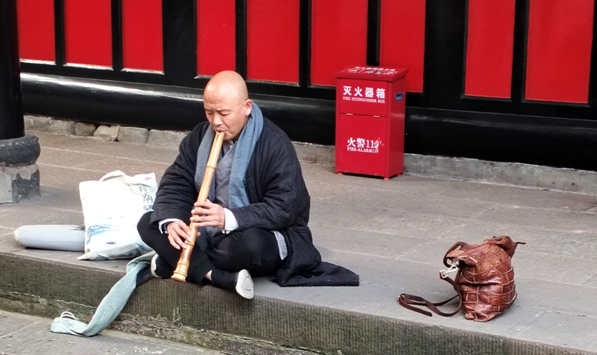

西南交大学子文化寻根，感受厚重历史
	从1月9日开始，西南交通大学力学与航空航天学院赴四川博物院等地调研实践队在成都多个博物馆开展“返家乡”社会实践，深入学习了解成都文化和历史变迁，并在之后14天中使用线上线下多种方式宣传成都文化。本次实践以“寻巴蜀文化，探蓉城魅力”为主题，旨在坚定文化自信，让同学们深刻地感受我们脚下的土地那厚重的历史。
	在四川博物馆，队员们看到四川古代精美的画像砖以及多件即使经过了千年但仍然闪闪发光的青铜器，赞叹于四川古代文化的繁盛和生产制造技艺的发达。“曾经我以为古代不仅物质上是十分落后的，文化上也很单一，但是现在我觉得每个时代都有自己骄傲的东西”，一位队员当天如此总结到。

	队员还前往了成都博物馆更全面地了解成都本地的文化。队员们专注于成都在近千年历史中的摧毁和重建，赞叹成都人民和成都文化强大的生命力，并不断地吸收着周围地域，甚至波斯的文化，展示其强大的包容性。“成都文化现在肯定不会消亡，它还会越来越发达，而传承和发扬这种文化正是我们的任务。”在赞叹之余，实践队员们感受到了自己肩上的担子越来越重。
	带着这份沉重的责任感，队员们尝试了多种方式宣传成都文化，用自己的实际行动传承和发扬了成都传统文化。
	文化宣传从孩子抓起，队员们在天津某学校组织开展了一次以青花瓷为切入点的成都文化的宣传活动。通过青花瓷这样一个家喻户晓的成功案例，让年纪尚还很小的小朋友们从此埋下一颗文化自信的种子。不仅仅对于小朋友有意义，实践队员们还表示：“以前听类似的宣传都觉得也没记住什么，但是当自己学习过后对所有的一切印象都更深刻了。”

	12日，在文殊院，队员们仍然保持着高涨的学习热情，仔细地考量着文殊院建筑的方方面面，观察着建筑的各个细节，体会着这背后体现的厚重的文化积淀。“以前来这里都没有觉得这里有这么多值得考察的细节”，一位本地的队员坦言道。
	越向里面走，传统文化的生机和活力越发地体现出来，僧人早课阅读气势磅礴；庙中僧人手持笛子，席地而坐便吹起来，引得众人围观；墙壁上悬挂着众多诗词画作，不觉中熏陶着我们的文化精神，传承着从东汉佛教传入成都时所强调“欲得净土，当净其心；随其心净，则佛土净”的修行宗旨，也展示着成都这个地方的人们安静释然的生活态度。

图为僧人在吹笛。冯开元 供图
	在当代，网络上的宣传才是主力军，线下宣传的力度总是没有线上宣传的范围广。针对这样的现实情况，队员们齐心制作了一个网站（https://bashu.nonamewebsite.us.kg）用于网上开展宣传，并制作了一系列的视频和宣传文字，涵盖博物馆介绍、成都茶文化介绍等等多个方面，向不了解成都文化的人们普及了一些有关成都的知识，也为国家文化振兴的发展战略也做出了属于自己的贡献。
	“路漫漫其修远兮，吾将上下而求索”，怀着学习的心态了解成都、四川或者中国的传统文化，带着传承和发扬的目的应用它们。“坚定文化自信，弘扬传统文化”正是我们这一代青年肩上的责任，在中华民族伟大复兴的关键节点上，我辈青年必须承担起这样的任务！（通讯员 冯开元）