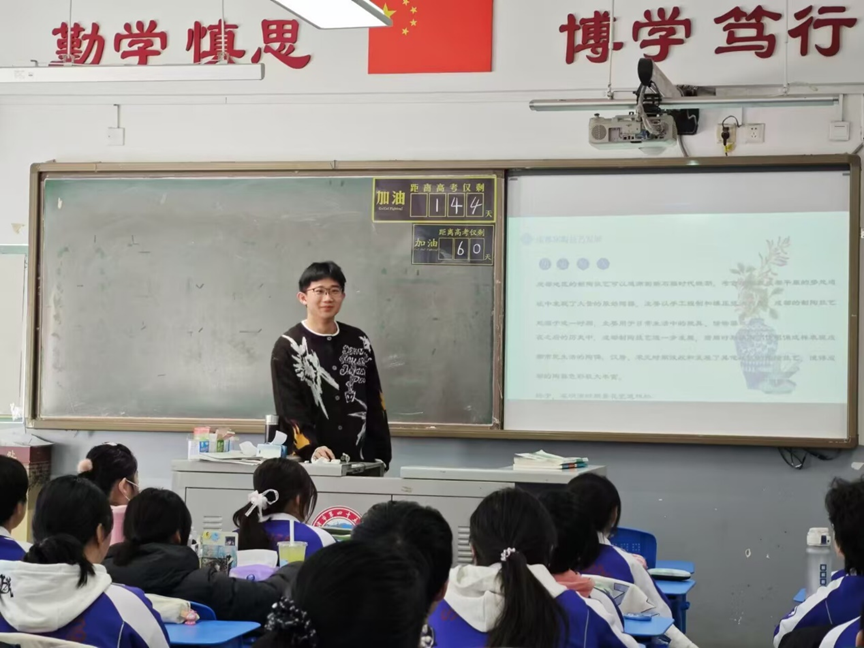

寻巴蜀文化，探蓉城魅力
为了更多地了解成都文化的历史发展变迁和重要意义，巴蜀文化调研实践队于1月9日至1月12日开展实践活动，前往四川博物院、成都博物院、文殊院开展了为期三天的成都文化探索之旅，深入探索学习了成都文化内涵和其历史发展历程。
1月9日，实践队组织了本次活动的研讨会，研讨会上队员们讨论了自己对于成都文化的了解，为后续三天的实践活动做了准备。

i 1月9日研讨照片 
随后三天实践队分别前往了四川博物院、成都博物院、文殊院进行参观、学习，分别就有关四川文化对于成都文化的影响、成都文化的历史发展变化、成都文化在文学、建筑等上的体现、成都文化的现代传承情况等问题进行了考察。本次实地参观学习提升了队员们对于成都文化的物质基础、成都文化与周边文化的相互交融和影响、成都佛教与建筑文化发展水平的了解。从而使队员们建立起对于成都文化的更加全面的认识，有了更加立体的见解和体会。

ii 四川博物院合照 
1月12日，在结束了文殊院的参观之后，在研讨会上队员们首先就自己这几天的学习成果进行了讨论，全面总结了三天中的收获。
在实践考察阶段完成之后，队员们纷纷表示收获颇丰，也感到传承和发扬成都文化的责任之重，于是实践队在之后的时间中继续使用包括线上线下等多种方式针对成都文化开展宣传活动。
文化宣传要从青年抓起，于是队员们与某天津宣讲队伍联系，以青花瓷为切入点向高三学生宣传成都文化，将几天实践中的收获通过宣讲的方式输出，让更多地方的人知道成都文化。通过这个活动也向学生们强调了传承和发扬传统文化的重要性，即使学业紧张也不能忘记传统文化。
 
iii 宣讲时宣传传统文化 
不仅仅是线下宣传，在当今社会线上宣传更是不能被忽视。为此，实践队共同搭建了一个网站(https://bashu.nonamewebsite.us.kg)用于队伍宣传资源的汇总。实践队组织制作了关于队伍和成都文化的宣传视频，并且在各大网站投稿，力求让更多人对成都文化产生兴趣。除此之外实践队还针对茶文化等成都传统文化和四川博物院、成都博物院、文殊院分别写了介绍文档，方便感兴趣的人们了解他们。
正所谓“文化立世，文化兴邦”，，坚持文化自信不可缺少的就是文化的宣传。成都文化作为中国文化中的一个分支，也需要我们去传承和发扬，本次活动正为此提供了许多新的机会，鼓励了我校师生去更多地了解他们一直生活的土地，发扬这里的文化。
